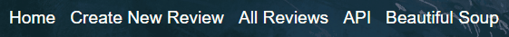

# Introduction
As part of a student enrolled in the Software Developer Boot Camp at The Tech Academy, I worked on a Python Live Project for two weeks. I worked on creating a basic application, utilizing Python and the Django Framework, that has basic CRUD functionality, as well as an API and Beautiful Soup integration. The application allowed users to write reviews of a video game of their choosing, and then save that review to a database for viewing later. My app was part of a larger project that other students were also working on, although each app was relatively self-contained. As part of this project, we also practiced the Agile/Scrum methodology. This included daily online standup meetings, as well as code retrospectives at the end of each week. The project itself was organized through Azure Devops.

In order to facilitate our progress throughout the project, each student was assigned a set sequence of user stories. These stories contained tasks for us to complete when building our app, and what was expected. However, we were not explicitly guided through the tasks, and needed to rely on outside research and our own testing/debugging in order to make the app functional. This was a tremendous learning experience on my part, as getting this hands-on experience allowed me to become better at researching and writing code on my own.

# CRUD Functionality
- ## Create
  One of the first stories I was assigned was to create a model for the item and categories I wanted to track. In this case, I wanted to track user-generated         reviews     of video games, including the game name, reviewer name, review score, review text, and date reviewed. To accomplish this, I created this model,         including a model manager:
  
  ```
  class Review(models.Model):
    game_title = models.CharField(max_length=50)
    game_score = models.PositiveIntegerField(default=1)
    review_text = models.TextField(default='')
    reviewer_name = models.CharField(max_length=50)
    date_reviewed = models.DateField()
    
    Reviews = models.Manager()
  ```
    
  I then created a views function in order to allow the user to save their review to the database, as well as render the actual page for doing so:
    
  ```
  def video_game_create(request):
  form = ReviewForm(data=request.POST or None)
  if request.method == 'POST':
      if form.is_valid():
          form.save()
          # Redirects to home page after form is saved
          return redirect('video_game_display')
  content = {'form': form}
  return render(request, "VideoGameReviews/VideoGameReviews_create.html", content)
  ```
  
  The actual form itself was a Modelform, based on the Review model:
  
  ```
  class ReviewForm(ModelForm):
      class Meta:
          model = Review
          fields = '__all__'
          widgets = {
              # Here I am assigning widgets and giving each field an attribute that I'm using for basic CSS styling
              'game_score': forms.Select(choices=SCORE_CHOICES, attrs={'class': 'create-form-fields'}),
              'date_reviewed': forms.SelectDateWidget(attrs={'class': 'create-form-fields'}),
              'game_title': forms.TextInput(attrs={'class': 'create-form-fields'}),
              'review_text': forms.Textarea(attrs={'class': 'create-form-fields'}),
              'reviewer_name': forms.TextInput(attrs={'class': 'create-form-fields'}),
          }
  ```
  
  The SCORE_CHOICES were just the numbers 1-10.
  
- ## Read
  The next two stories were concerned with both creating a page that listed every item saved to the database, and allowing a user to click on an item to that list     and be taken to a details page for that review. I needed to create more HTML pages for this functionality, but since we were working with Django, I utilized         template inheritance to speed up the process. First, I started on creating a page to show a list of all database items. I created a views function that used the     object manager to pass in all the database objects to the page, and used the Django 'for' tag in order to display each item in its own row within a table. I also   wanted to add a search bar so that the user could quickly filter through results:
  
  ```
  class SearchResults(ListView):
    model = Review
    template_name = 'VideoGameReviews/VideoGameReviews_search.html'
    context_object_name = 'all_search_results'

    def get_queryset(self):
        result = super(SearchResults, self).get_queryset()
        # Storing user input from form as variable
        query = self.request.GET.get('search')
        if query:
            # User can search by either game title or reviewer name
            postresult = Review.Reviews.filter(
                Q(game_title__contains=query) | Q(reviewer_name__contains=query)
            )
            result = postresult
        else:
            result = None
        return result
  ```
  
  Then, I added functionality for the user to be able to click on any review and be taken to a details page that displayed the full set of information about the       review. This was relatively simple, as it just required getting the object from the database and displaying it on the page along with some labels for clarity.
  
- ## Update and Delete
  The next story required the user to be able to make changes to any individual review that were subsequently saved to the database, as well as fully delete any       review. The edit function was relatively similar to the create function, but I needed to use `get_object_or_404` in conjunction with a primary key in order to       retrieve the particular review. The delete function was also relatively simple, however, I wanted to use CSS and JavaScript in order to create a delete             confirmation box (modal):
  
  ```
  var modal = document.getElementById("myModal");

  var btn = document.getElementById("myBtn");

  var span = document.getElementsByClassName("close")[0];

  var close = document.getElementById("closeButton");

  btn.onclick = function() {
      modal.style.display = "block";
  }

  span.onclick = function() {
      modal.style.display = "none";
  }

  close.onclick = function() {
      modal.style.display = "none";
  }

  window.onclick = function(event) {
      if (event.target == modal) {
          modal.style.display = "none";
      }
  }
  ```
  
# API
I was making good progress on the project, and decided to take the stories regarding connecting and getting data from an API. I decided to use an API from [giantbomb.com](https://www.giantbomb.com/) since the website had a lot of information pertaining to video games:

```
def video_game_api(request):
    # Getting information/api from giantbomb.com
    # Getting game id, name, summary, the date it was added to the site, and a link to the game page on the site
    response = requests.get(
        "https://www.giantbomb.com/api/games/?api_key=MY_API_KEY&format=json&limit=10&sort=date_added:desc&field_list=name,deck,site_detail_url,id,date_added",
        headers={'User-Agent': 'required'}  # This header is required for the api to work
    )
    info = json.loads(response.text)

    # Creating empty lists to later store info from api
    game_id = []
    name = []
    summary = []
    date_added = []
    link = []

    # Loops through all items in dictionary named "results"
    for item in info["results"]:
        json_id = item["id"]
        game_id.append(json_id)

        json_name = item["name"]
        name.append(json_name)

        json_summary = item["deck"]
        summary.append(json_summary)

        json_date = item["date_added"]
        date_added.append(json_date)

        json_link = item["site_detail_url"]
        link.append(json_link)

    # Zipping together in order to match up items from lists above at each index
    full_list = zip(game_id, name, summary, date_added, link)
    content = {"full_list": full_list}
    return render(request, "VideoGameReviews/VideoGameReviews_api.html", content)
```

I specified certain fields in the API call to get exactly the information I wanted. I then parsed through the JSON response in order to grab what I was looking for, created a list from those items, zipped them together to keep the data linked, and passed it to the template. Then, I used the Django 'for' tag in order to display the information in a table.

## Web Scraping (Beautiful Soup)
I was then given the task to use the Beautiful Soup library to scrape information of my choosing from the web. To stick to the theme, I decided to scrape a list of the [best-selling video games](https://en.wikipedia.org/wiki/List_of_best-selling_video_games) from [Wikipedia](https://www.wikipedia.org/). In order to accomplish this, I made use of the Chrome Developer Tools to find the specific HTML elements I was looking for, and then created the function:

```
def video_game_beautiful_soup(request):
    response = requests.get("https://en.wikipedia.org/wiki/List_of_best-selling_video_games")
    soup = BeautifulSoup(response.content, 'html.parser')
    # Gets specific table I'm looking for on the original page
    table = soup.find_all('table')[1]
    # Cleans up table formatting
    pretty_table = table.prettify()
    content = {"pretty_table": pretty_table}
    return render(request, "VideoGameReviews/VideoGameReviews_beautiful_soup.html", content)
```

After that, it was only a matter of creating the HTML page and accessing the information using `{{ pretty_table | safe }}`. The safe filter was necessary to prevent the raw HTML from being escaped, so the table would display correctly.

# Front End Improvements
As my time on the Live Project was nearing its end, I made some CSS improvements to the buttons, links, searchbar, and navbar on the site. This included hover effects on certain elements, as well as some minor spacing adjustments. Here is an example:



Yes
